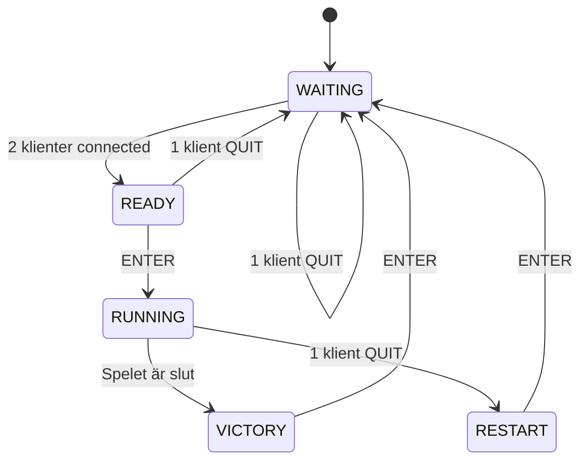

# Protokoll
#### Översikt
Protokollet beskriver kommunikationen mellan en central server som hanterar spel- och server-status och 2 klienter som är spelare i spelet. Kommunikationen sker genom textsträngar via TCP-sockets. Protokollet är strukturerat för att vara stabilt mot trasig data och för att möjliggöra att multipla klienter kan anslutas och interagera med servern samtidigt utan problem. All data som skickas är textsträngar kodade i UTF-8. 
###### Från klient till server:
1. **Rörelse** - `UP`, `DOWN`, `LEFT`, `RIGHT`
- Klienten skickar en av dessa strängar för att signalera en förflyttning i respektive riktning.
2. **Interaktion** - `DROP`, `ENTER`, `QUIT`
- `DROP`: Klienten droppar en sak vid sin nuvarande position.
- `ENTER`: Sätt spelet i vänt- eller spelläge, alternativt avsluta vunnet spel.
- `QUIT`: Klienten avslutar spelet, från alla states.
###### Från server till klient:
1. **Rensa terminal** - `CLEAR`
- `CLEAR`: Ber klienten att rensa sin terminalskärm innan ny data skickas.
2. **Spelstatus** - Rendering av spelet
- Ny data skickas som representerar spelet
3. **Användarmeddelanden** - meddelanden om spel/server-status
- `Could not connect, game not ready...`
- `Waiting for another player to connect...`
- `Press [enter] to play!`
- `Press [enter] to close game!`
- `Press [enter] to return to menu!`
4. **Stäng av klient** - meddelanden om att stänga av klienten
- `Closing connection...`
##### Säkerhet:
- Om en klient skickar trasig data kommer servern hantera detta utan att krascha genom att ignorera oväntade kommandon.
- Servern hanterar om en klient kopplar ifrån genom att minskat antalet anslutna klienter och skickar korrekt meddelande till de resterande.
##### Tillståndsdiagram:
1. **WAITING**
- Servern väntar på att minst två klienter ska ansluta.
- Om en klient skickar `QUIT` här återgår den till `WAITING`-tillståndet.
2. **READY**
- Två klienter är anslutna, och spelet väntar på `ENTER` kommandot för att börja.
- `QUIT` återgår till `WAITING`.
3. **RUNNING**
- Spelet pågår, spelare kan flytta sig (`UP`, `DOWN`, `LEFT`, `RIGHT`) och droppa saker (`DROP`).
- Om en spelar klarar målet, ändras tillståndet till `VICTORY`.
4. **VICTORY**
- Spelet är vunnet, spelarna kan trycka `ENTER` för att avsluta spelet.
5. **RESTART**
- Den andra spelaren har kopplat bort sig. Tryck `ENTER` för att återvända till menyn.

### Diagram:

